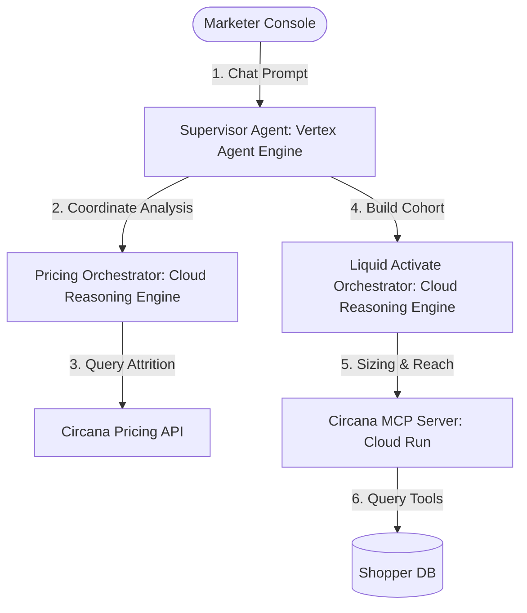
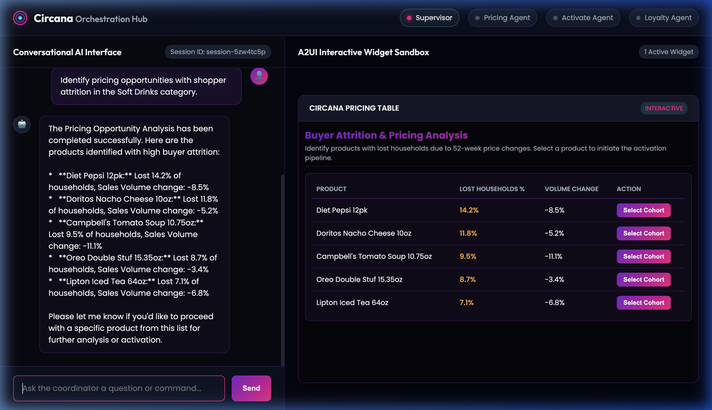

# Retail Multi-Agent Orchestration Hub & GCP Agent Platform Integration

The **Retail Multi-Agent Orchestration Hub** is a premium, state-of-the-art pilot portal demonstrating a conversational AI interface coupled with an interactive sandbox canvas. The system coordinates retail pricing analytics, cohort construction, audience sizing, and marketing activations across a hybrid multi-agent network.

---

## 🎥 Web Application Demo Walkthrough

Explore the E2E user flow of the Multi-Agent Portal, showing session initialization, tool execution, dynamic widget rendering, and safety blocks:


---

## 1. System Architecture

The portal is built on a **Supervisor-Orchestrator** model consisting of a central web application layer directing tasks to specialized agent microservices:



### Core Components
1. **Supervisor (PilotSupervisor):** Serves as the primary conversational dispatcher, translating user intents into orchestration tasks and executing UI callbacks.
2. **Pricing Agent (PricingAssortmentOrchestrator):** Analyzes retail product catalog sales volume changes and buyer attrition to identify pricing opportunities.
3. **Activation Agent (LiquidActivateOrchestrator):** Constructs, scales, and sizes custom audience segments (e.g., lapsed buyers of Diet Pepsi), and handles activation exports to marketing partners.
4. **Loyalty Agent (LoyaltyCampaignOrchestrator):** Designs and creates personalized loyalty card campaign offers for target shopper cohorts.

---

## 2. GCP Agent Platform: Component Breakdown & Citations

The architecture is built on the enterprise-grade capabilities of the **Google Cloud Agent Platform**:

### 🛡️ Model Armor
*   **Definition:** A managed service designed to serve as a guardrail wrapper around LLM prompts and responses. It screens input strings for prompt injection, jailbreak attempts, and toxic content, and redacts sensitive Personally Identifiable Information (PII) before it reaches the model.
*   **System Integration:** Our supervisor uses Model Armor to sanitize user prompts inline. Any jailbreak string is immediately blocked, raising a validation exception.
*   **Official Citation:** 
    > *"Vertex AI Model Armor helps protect your generative AI models by scanning inputs and outputs for prompt injections, jailbreaks, PII, and unsafe content."* — [Google Cloud Vertex AI Model Armor Documentation](https://cloud.google.com/vertex-ai/generative-ai/docs/model-armor)
*   **Live Proof-of-Safety (Prompt Injection Blocked):**
    

### 🗃️ Agent Registry
*   **Definition:** The centralized catalog in GCP Agent Platform where custom tools, endpoints, and Model Context Protocol (MCP) servers are registered, authorized, and made discoverable.
*   **System Integration:** The `circana-mcp-server` is registered under the global Agent Registry services with protocol bindings for `JSONRPC` over HTTP/SSE, publishing our custom cohort building tools.
*   **Official Citation:**
    > *"Agent Registry provides a unified catalog to discover, govern, and reuse tools, APIs, and Model Context Protocol servers across your enterprise AI applications."* — [Google Cloud Agent Platform Registry Documentation](https://cloud.google.com/vertex-ai/generative-ai/docs/agent-registry)
*   **Live Proof-of-Registration (MCP Registry):**
    

### ⚙️ Vertex AI Agent Engine (Reasoning Engine)
*   **Definition:** A managed runtime environment that packages Python code, dependencies, and parameters into a serialized execution graph (via Cloudpickle) and deploys it as an API endpoint.
*   **System Integration:** All three Circana sub-agents are deployed as Cloud Reasoning Engines under Python 3.13 containers:
    *   **Pricing Engine:** `projects/943928157761/locations/us-central1/reasoningEngines/3371690339726262272`
    *   **Activate Engine:** `projects/943928157761/locations/us-central1/reasoningEngines/1265131614023712768`
    *   **Loyalty Engine:** `projects/943928157761/locations/us-central1/reasoningEngines/7172728425226960896`
*   **Official Citation:**
    > *"Vertex AI Reasoning Engine lets you deploy python-based orchestration frameworks (such as LangChain or custom agent models) to Google Cloud as fully-managed endpoints."* — [Google Cloud Vertex AI Reasoning Engine Guide](https://cloud.google.com/vertex-ai/generative-ai/docs/reasoning-engine/overview)

### 🔌 Model Context Protocol (MCP) Server
*   **Definition:** An open-standard client-server protocol developed to expose local data schemas, documents, and tools to LLMs in a structured format.
*   **System Integration:** Deployed on Google Cloud Run to provide private DB query bindings, preventing raw shopper metrics from leaking directly into the LLM context.

### 🌐 Agent Gateway & Connectivity
*   **Definition:** Exposes private VPC resources, on-premises data lakes, and private Cloud Run tools to GCP Agent Engine using IAM-authorized private reverse proxies or Private Service Connect (PSC).

### 💾 Session Service & Memory Bank
*   **Definition:** Vertex AI Agent Platform session store records detailed step-by-step history logs for agent evaluations. The Memory Bank stores structured personalization embeddings, enabling agents to remember user preferences across sessions.
*   **System Integration:** Our FastAPI portal queries the managed `sessions` endpoints of Vertex GenAI Client to store and list conversation histories.

---

## 3. E2E Execution Flow & Interactive Dashboards

### Step A: Identify Pricing Opportunities
The supervisor delegates the initial query to the **Pricing Agent**, which queries historical store attrition data and projects an interactive product selection table into the browser canvas:



---

### Step B: Audience Sizing Dashboard
Clicking **Select Cohort** on the widget triggers a Human-in-the-Loop callback. The supervisor invokes the **Activation Agent**, which executes tools on the registered `circana-mcp-server` Cloud Run instance. Sizing counts and activation channel selections are rendered on a polished dashboard card:


---

### Step C: Export Sync Confirmation
Upon selecting the channels (LiveRamp, Google Customer Match) and clicking **Activate**, the agent runs the export tool and writes success events back to the session logger:


---

## 4. Local Web App Setup & Execution

### Prerequisites
*   Python 3.13 Virtual Environment (`.venv`)
*   Google Cloud SDK initialized on project `shade-sandbox`.

### Step 1: Environment Variables Setup
Initialize `.env` in the project root:
```env
GOOGLE_GENAI_USE_VERTEXAI=true
GOOGLE_CLOUD_PROJECT=shade-sandbox
GOOGLE_CLOUD_LOCATION=us-central1
GOOGLE_GENAI_MODEL=gemini-2.5-flash

# Cloud Run MCP Server Url
MCP_SERVER_URL=https://circana-mcp-server-943928157761.us-central1.run.app

# Deployed Cloud Reasoning Engine Resource IDs
PRICING_AGENT_URL=projects/943928157761/locations/us-central1/reasoningEngines/3371690339726262272
ACTIVATE_AGENT_URL=projects/943928157761/locations/us-central1/reasoningEngines/1265131614023712768
LOYALTY_AGENT_URL=projects/943928157761/locations/us-central1/reasoningEngines/7172728425226960896
```

### Step 2: Start the Web Portal App
Run the dev server locally using the active virtual environment:
```bash
source .venv/bin/activate
uvicorn web_app.server:app --host 0.0.0.0 --port 8000
```
Open your browser and navigate to `http://localhost:8000` to start orchestrating.
