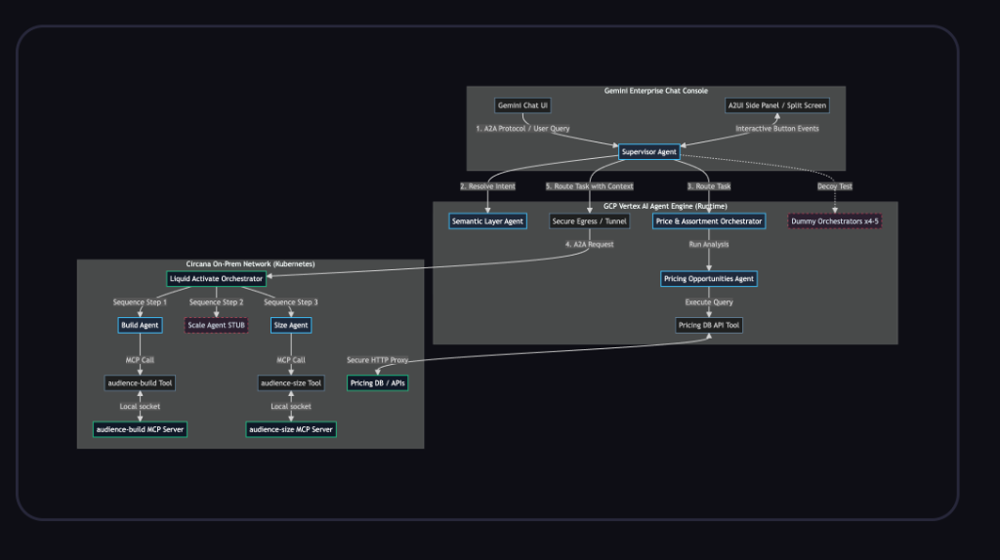
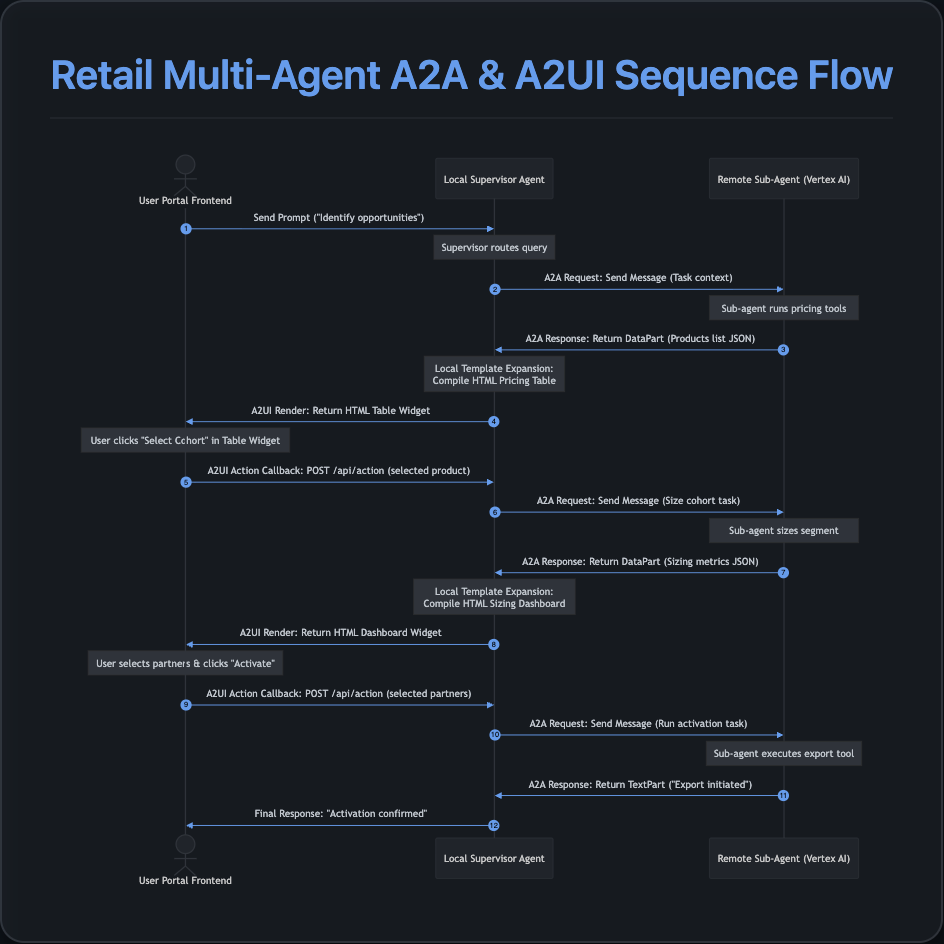

# Retail Multi-Agent Orchestration Hub

The **Retail Multi-Agent Orchestration Hub** is a premium, state-of-the-art pilot portal demonstrating a conversational AI interface coupled with an interactive sandbox canvas. The system coordinates pricing analytics, cohort construction, audience sizing, and marketing activations across a hybrid multi-agent network.

---

## 1. System Architecture

The portal is built on a **Supervisor-Orchestrator** model consisting of a central web application layer directing tasks to specialized agent microservices:



### Core Components
1. **Supervisor (PilotSupervisor):** Runs inside the local FastAPI backend. It serves as the primary conversational dispatcher, translating user intents into orchestration tasks and executing UI callbacks.
2. **Pricing Agent (PricingAssortmentOrchestrator):** Analyzes retail product catalog sales volume changes and buyer attrition to identify pricing opportunities.
3. **Activation Agent (LiquidActivateOrchestrator):** Constructs, scales, and sizes custom audience segments (e.g., lapsed buyers of Diet Pepsi), and handles activation exports to marketing partners.
4. **Loyalty Agent (LoyaltyCampaignOrchestrator):** Designs and creates personalized loyalty card campaign offers for target shopper cohorts.

---

## 2. A2A and A2UI Protocols

The application relies on two key architectural specifications from the **Agent Development Kit (ADK)**:

### A2A (Agent-to-Agent) Protocol
Conversations across different agents are structured using the standard A2A message formatting. Communication between the supervisor and sub-agents happens via:
*   **GenAI SDK Reasoning Engine Client:** Resolves the Remote Reasoning Engine in the cloud and executes the task.
*   **Simplified JSON Payload:** Sub-agents return data packages natively inside A2A `DataPart` structures rather than raw text, keeping LLM communication clean and structured.



### A2UI (Agent-to-User-Interface) Protocol
To enable interactive widgets (tables, check-boxes, and buttons) inside the portal, the system utilizes the **A2UI Protocol**:
1. Sub-agents return a structured layout definition under the `<a2ui-json>` schema.
2. The supervisor intercepts these payloads and binds them to the frontend widget area.
3. **Dynamic Template Expansion:** To prevent remote LLM copy-paste degradation or formatting errors, the supervisor uses local templates (`web_app/components.py`) to wrap simple JSON data structures into robust, premium HTML-styled widget packages before passing them to the browser sandbox.

---

## 3. Human-in-the-Loop (HITL) Flow

To prevent AI from executing critical actions asynchronously without supervision (e.g., spending advertising budgets or triggering bulk cohorts exports), the portal implements a strict **Human-in-the-Loop (HITL)** interaction model using **ADK / A2UI interactive callbacks**:

1. **Checkpoint Interrupt:** When a sub-agent executes a task that requires user confirmation, it returns a structured interactive layout instead of proceeding automatically.
2. **Interactive Rendering:** The frontend renders this layout as an interactive widget (e.g., checkboxes for LiveRamp and Google Ads, or a "Select Cohort" action button in a products table).
3. **Execution Pause:** The LLM's turn completes, leaving the portal in an idle state awaiting user action.
4. **Resuming via Action Callback:** When the user clicks a button or checks a partner box, the frontend triggers a `USER_ACTION` payload sent to the `/api/action` endpoint.
5. **Context Ingestion:** The backend server captures the callback variables, translates them into a clear semantic prompt describing the user's action (e.g., `"Action received: activate the segment on channels: LiveRamp. Proceed to export."`), and starts a new agent run context to execute the confirmation.

---

## 4. Step-by-Step Deployment Guide

### Prerequisites
*   Python 3.10+
*   Google Cloud SDK configured with authentication.
*   Access to Vertex AI Reasoning Engine permissions.

### Step 1: Environment Configuration
Create a `.env` file in the root directory:
```env
GOOGLE_GENAI_USE_VERTEXAI=true
GOOGLE_CLOUD_PROJECT=your-project-id
GOOGLE_CLOUD_LOCATION=us-central1
GOOGLE_GENAI_MODEL=gemini-2.5-flash
PROJECT_ID=your-project-id
STORAGE_BUCKET=gs://your-agent-staging-bucket
```

### Step 2: Deploy Orchestration Agents to Vertex AI
Navigate to the `agents` folder and run the deployment script:
```bash
cd agents
export $(cat ../.env | xargs)
PYTHONPATH=. ../.venv310/bin/python3 ../deploy.py
```
Upon completion, the deployment output will display the Reasoning Engine resource IDs. Update your `.env` file with these values for remote cloud resolution:
```env
# Remote Cloud Deployment Endpoint Format:
PRICING_AGENT_URL=projects/your-project-id/locations/us-central1/reasoningEngines/your-engine-id-1
ACTIVATE_AGENT_URL=projects/your-project-id/locations/us-central1/reasoningEngines/your-engine-id-2
LOYALTY_AGENT_URL=projects/your-project-id/locations/us-central1/reasoningEngines/your-engine-id-3
```

Alternatively, if you run the sub-agents locally (for faster iteration loops using local A2A servers), configure your `.env` to point to the local server ports:
```env
# Local Development Endpoint Format:
PRICING_AGENT_URL=http://localhost:10102
ACTIVATE_AGENT_URL=http://localhost:10103
LOYALTY_AGENT_URL=http://localhost:10104
```

### Step 3: Run the Local Web Application Portal
Start the FastAPI server from the project root:
```bash
python3 -m uvicorn web_app.server:app --host 127.0.0.1 --port 8000
```
Open your browser and navigate to `http://127.0.0.1:8000`.

---

## 4. Preparing for Git Commit & Repo Push

To clean up temporary files, virtualenv environments, and deployment logs before committing the code to a GitHub repository, a `.gitignore` has been prepared.

### Deleting Unnecessary Directories (`lib_ref` / `scratch`)
*   **`lib_ref/`:** This directory was used as a reference copy of the experimental library files and is no longer needed since packages are imported directly from `.venv310/`. It can be safely deleted.
*   **`scratch/`:** Contains developer playground scripts and local process managers. If you want a clean repository, you can remove this directory.

### `.gitignore` Setup
Ensure the following entries are present in your `.gitignore` to prevent committing secrets or build artifacts:
```gitignore
# Byte-compiled / optimized / DLL files
__pycache__/
*.py[cod]
*$py.class

# Environments
.venv/
.venv310/
env/
venv/
ENV/

# Configuration and Secrets
.env
*.gcloud/

# OS-specific
.DS_Store
Thumbs.db
```
