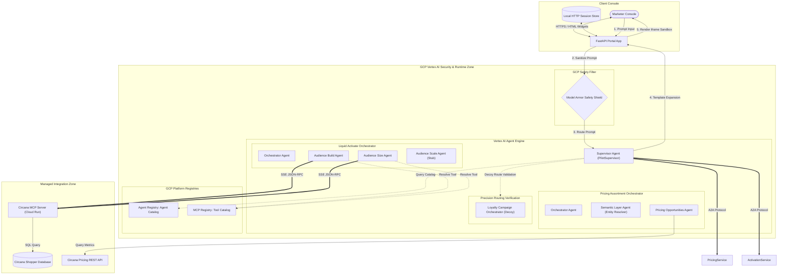
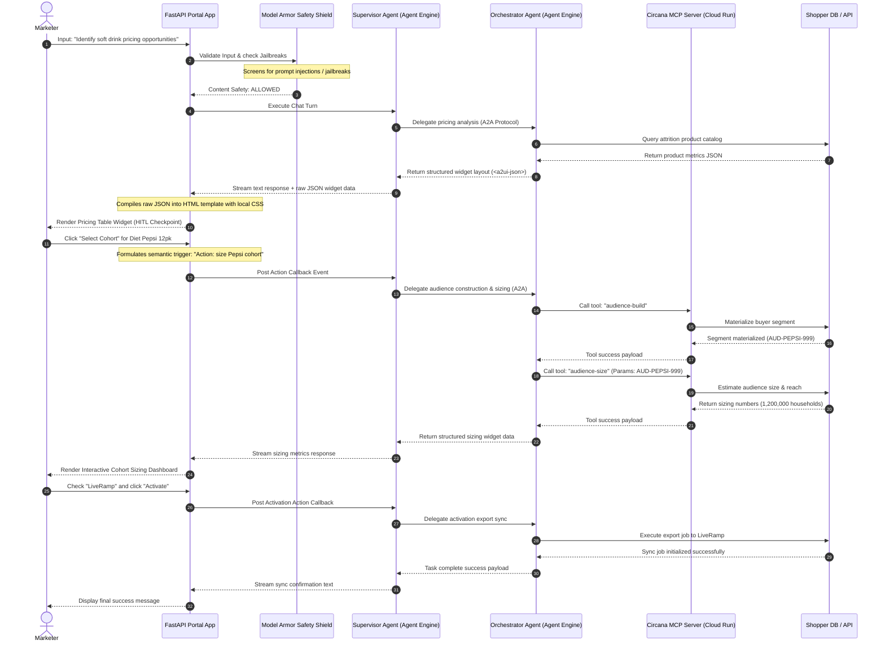

# Retail Multi-Agent Orchestration Hub & GCP Agent Platform Integration

The **Retail Multi-Agent Orchestration Hub** is a premium, state-of-the-art pilot portal demonstrating a conversational AI interface coupled with an interactive sandbox canvas. The system coordinates retail pricing analytics, cohort construction, audience sizing, and marketing activations across a hybrid multi-agent network.

---

## 🎥 Web Application Demo Walkthrough

Explore the E2E user flow of the Multi-Agent Portal, showing session initialization, tool execution, dynamic widget rendering, and safety blocks:


---

## 1. System Architecture & Topology

The application is built on the **Google Cloud Agent Platform**, implementing a secure, stateful multi-agent hierarchy governed by Model Armor and integrated with custom tools via the Model Context Protocol (MCP):



### Core Architecture Components

1.  **FastAPI Portal App & HTTP Sessions:** Manages local user sessions, authenticates identity against Google/Entra Identity Providers, and maintains conversation states locally before dispatching payloads downstream.
2.  **Model Armor Safety Shield:** Acts as an inline firewall for the LLM. Every user prompt is scanned for prompt injection, hate speech, and jailbreak vectors. Every agent output is scanned to redact sensitive PII (Social Security or Credit Card numbers).
3.  **Vertex AI Agent Engine (Reasoning Engine):** Google Cloud's serverless container runtime that packages python-based agent orchestration frameworks and executes them securely under IAM policies.
4.  **Agent & MCP Registry:** Centralized registries that host global metadata configurations. The **Agent Registry** catalog allows the Supervisor to discover sub-agent microservice endpoints, and the **MCP Registry** publishes the schemas of tools hosted on external MCP servers.
5.  **A2A (Agent-to-Agent) Protocol:** Structured JSON message schema that allows the Supervisor to pass structured tasks and raw parameter definitions to sub-agents (and vice-versa) using A2A `DataPart` slots instead of raw unstructured text.
6.  **A2UI (Agent-to-User-Interface) Protocol:** Formats widget schemas (`<a2ui-json>`) returned by agents. The Supervisor intercepts these declarations and expands them into premium HTML widget sandboxes before streaming them to the client console.
7.  **Circana MCP Server on Cloud Run:** Host service built to run the Model Context Protocol in the cloud. It wraps our custom Audience Builder database APIs into standard MCP JSON-RPC schemas and exposes them safely via HTTPS.

---

## 2. Master Sequence Flow

The following sequence diagram details how user inputs are processed, sanitized, delegated via A2A, checked for Human-in-the-Loop constraints, and projected onto the UI via A2UI widgets:



---

## 3. GCP Agent Platform Component References & Citations

### 🛡️ Model Armor
*   **Definition:** A managed safety service designed to serve as a guardrail wrapper around LLM prompts and responses. It screens input strings for prompt injection, jailbreak attempts, and toxic content, and redacts sensitive Personally Identifiable Information (PII) before it reaches the model.
*   **System Integration:** Our supervisor uses Model Armor to sanitize user prompts inline. Any jailbreak string is immediately blocked, raising a validation exception.
*   **Official Citation:** 
    > *"Vertex AI Model Armor helps protect your generative AI models by scanning inputs and outputs for prompt injections, jailbreaks, PII, and unsafe content."* — [Google Cloud Vertex AI Model Armor Documentation](https://cloud.google.com/vertex-ai/generative-ai/docs/model-armor)
*   **Live Proof-of-Safety (Prompt Injection Blocked):**
    

### 🗃️ Agent Registry & MCP tool registry
*   **Definition:** The centralized catalog in GCP Agent Platform where custom tools, endpoints, and Model Context Protocol (MCP) servers are registered, authorized, and made discoverable.
*   **System Integration:** The `circana-mcp-server` is registered under the global Agent Registry services with protocol bindings for `JSONRPC` over HTTP/SSE, publishing our custom cohort building tools.
*   **Official Citation:**
    > *"Agent Registry provides a unified catalog to discover, govern, and reuse tools, APIs, and Model Context Protocol servers across your enterprise AI applications."* — [Google Cloud Agent Platform Registry Documentation](https://cloud.google.com/vertex-ai/generative-ai/docs/agent-registry)
*   **Live Proof-of-Registration (MCP Registry):**
    

### ⚙️ Vertex AI Agent Engine (Reasoning Engine)
*   **Definition:** A managed runtime environment that packages Python code, dependencies, and parameters into a serialized execution graph (via Cloudpickle) and deploys it as an API endpoint.
*   **System Integration:** All three Circana sub-agents are deployed as Cloud Reasoning Engines under Python 3.13 containers:
    *   **Pricing Engine:** `projects/943928157761/locations/us-central1/reasoningEngines/3371690339726262272`
    *   **Activate Engine:** `projects/943928157761/locations/us-central1/reasoningEngines/1265131614023712768`
    *   **Loyalty Engine:** `projects/943928157761/locations/us-central1/reasoningEngines/7172728425226960896`
*   **Official Citation:**
    > *"Vertex AI Reasoning Engine lets you deploy python-based orchestration frameworks (such as LangChain or custom agent models) to Google Cloud as fully-managed endpoints."* — [Google Cloud Vertex AI Reasoning Engine Guide](https://cloud.google.com/vertex-ai/generative-ai/docs/reasoning-engine/overview)

---

## 4. E2E Execution Flow & Interactive Dashboards

### Step A: Identify Pricing Opportunities
The supervisor delegates the initial query to the **Pricing Agent**, which queries historical store attrition data and projects an interactive product selection table into the browser canvas:


---

### Step B: Audience Sizing Dashboard
Clicking **Select Cohort** on the widget triggers a Human-in-the-Loop callback. The supervisor invokes the **Activation Agent**, which executes tools on the registered `circana-mcp-server` Cloud Run instance. Sizing counts and activation channel selections are rendered on a polished dashboard card:


---

### Step C: Export Sync Confirmation
Upon selecting the channels (LiveRamp, Google Customer Match) and clicking **Activate**, the agent runs the export tool and writes success events back to the session logger:


---

## 5. Local Web App Setup & Execution

### Prerequisites
*   Python 3.13 Virtual Environment (`.venv`)
*   Google Cloud SDK initialized on project `shade-sandbox`.

### Step 1: Environment Variables Setup
Initialize `.env` in the project root:
```env
GOOGLE_GENAI_USE_VERTEXAI=true
GOOGLE_CLOUD_PROJECT=shade-sandbox
GOOGLE_CLOUD_LOCATION=us-central1
GOOGLE_GENAI_MODEL=gemini-2.5-flash

# Cloud Run MCP Server Url
MCP_SERVER_URL=https://circana-mcp-server-943928157761.us-central1.run.app

# Deployed Cloud Reasoning Engine Resource IDs
PRICING_AGENT_URL=projects/943928157761/locations/us-central1/reasoningEngines/3371690339726262272
ACTIVATE_AGENT_URL=projects/943928157761/locations/us-central1/reasoningEngines/1265131614023712768
LOYALTY_AGENT_URL=projects/943928157761/locations/us-central1/reasoningEngines/7172728425226960896
```

### Step 2: Start the Web Portal App
Run the dev server locally using the active virtual environment:
```bash
source .venv/bin/activate
uvicorn web_app.server:app --host 0.0.0.0 --port 8000
```
Open your browser and navigate to `http://localhost:8000` to start orchestrating.
